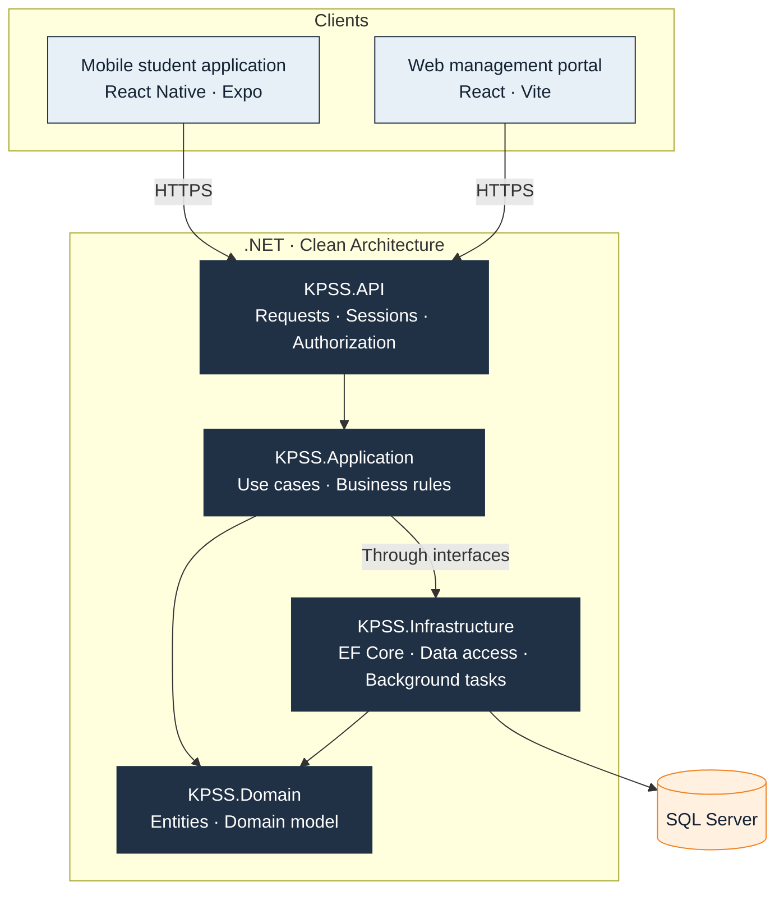
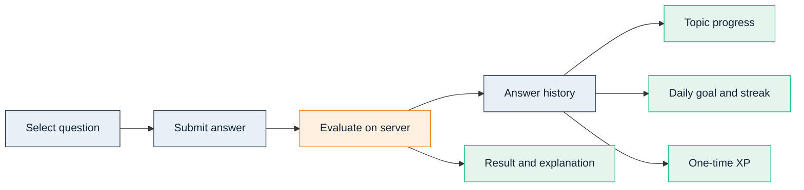
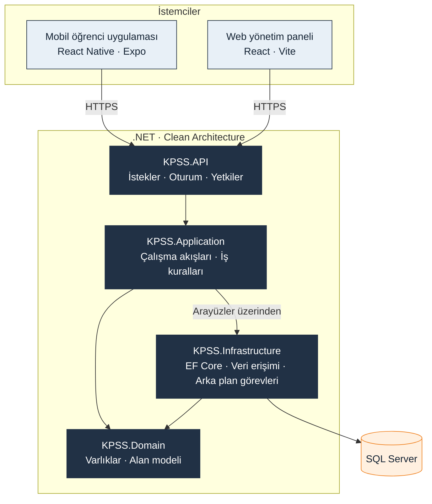
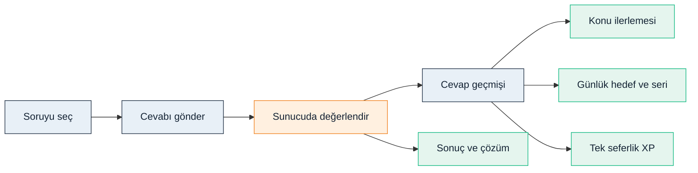

<h1 align="center">KPSS ODAK</h1>

**Mobile student application · Web management portal · 2026**

[English](#english) · [Türkçe](#türkçe) · [Database design / Veritabanı tasarımı](docs/DATABASE_DESIGN.md) · [Full product tour / Ayrıntılı tanıtım](docs/PRODUCT_TOUR.md)

---

### Screens at a glance / Ekranlara bakış

**01** Home / Ana sayfa · **02** Curriculum / Müfredat · **03** Question solving / Soru çözümü  
**04** Statistics / İstatistikler · **05** Mistakes / Hatalarım · **06** Custom practice / Özel test  
**07** Filters / Filtreler · **08** Study calendar / Çalışma takvimi · **09** Leaderboard / Liderlik

[View each screen with its explanation / Her ekranı açıklamasıyla incele →](docs/SCREENSHOTS.md)

### Web management portal / Web yönetim paneli

[Explore every panel module / Panelin tüm alanlarını incele →](docs/ADMIN_PANEL.md)

---

## English

### A complete study and management experience

KPSS ODAK is a mobile study application and web management portal I developed for candidates preparing for Türkiye's Public Personnel Selection Examination. It connects organized question practice with visible progress, focused revision and daily study habits. The management portal gives administrators and instructors a shared workspace to maintain content and support students.

### What students can do

- **Study by subject, topic and subtopic:** follow the curriculum, choose an area and see completion progress.
- **Practice with purpose:** use topic-based sessions, mixed practice and Quick Solve, with priority given to unanswered questions.
- **Review results:** see correct, incorrect and unanswered counts, exam net score, accuracy and solution explanations.
- **Return to difficult questions:** revisit the mistake pool and save questions for later.
- **Build a routine:** set exam and score targets, track daily goals, study streaks and calendar activity.
- **Stay engaged:** follow weekly and all-time rankings and check exam countdowns.
- **Manage their account:** review package access, use access codes, contact support and report questions.

### A management portal beyond content entry

The web panel combines **curriculum and question publishing**, **question-report review**, **users and roles**, **packages and subscriptions**, **promotional access codes**, **exam calendars**, **study-streak operations**, **support**, **store sales reporting** and **operation history**.

Questions move from preparation to publication; feedback can lead to a question correction without losing report history. Administrators manage feature access through packages, while instructors work within their assigned permissions.

[Explore the complete student and management experience →](docs/PRODUCT_TOUR.md#english)

### Technologies

**Mobile:** React Native · Expo · TypeScript  
**Web portal:** React · Vite · Tailwind CSS · TypeScript  
**Server & data:** .NET 9 · C# · ASP.NET Core · Entity Framework Core · SQL Server

### System architecture

Two clients share the same server-side workflows and data. The backend is organized into API, Application, Domain and Infrastructure layers. Application workflows use service and repository interfaces; Infrastructure provides persistence and background processing.

Arrows show request flow and collaboration, rather than a complete project-reference graph. Domain models describe the core learning and management entities; database access is handled through Infrastructure.

### Database design

The relational model separates **learning content**, **student activity**, **package access** and **management history**. This allows questions to be maintained independently of student answers and lets subscription history remain separate from current access.

- **Curriculum:** Subjects → Topics → Subtopics, with Questions and QuestionOptions.
- **Learning records:** Users connect to answer history, topic summaries, daily activity, saved questions and XP entries.
- **Access:** SubscriptionPlans and Features are joined through PlanFeatures; UserSubscriptions record user package periods.
- **Operations:** question reports, support conversations, code usage, store events and audit history support day-to-day management.

[View the four entity-relationship diagrams and design decisions →](docs/DATABASE_DESIGN.md#english)

### From an answer to measurable progress

Answers are evaluated on the server. Completion counts distinct questions, so repeat practice does not inflate curriculum progress. A question awards XP on its first correct solution only. The mistake pool reflects the latest answer, allowing a corrected mistake to leave the review list.

### Engineering details that support the experience

**Data consistency.** Unique constraints, transactions and user-scoped coordination protect package assignments, code redemption and repeated operations. Topic summaries, activity records and XP entries serve different purposes instead of mixing every learning event into one record.

**Access control.** Server-side sessions identify the user. Roles govern management permissions, while package entitlements govern paid feature access. These two decisions are handled separately.

**Content integrity.** Correct answers and explanations are returned after evaluation rather than included in an unanswered question. Student reports retain useful historical information even when the referenced question or account is removed.

**Background processing.** Study-streak maintenance and answer-based question-difficulty updates run independently of the practice screen. Difficulty can also be controlled manually by staff.

**Traceability.** Management changes, access-code redemptions and store subscription events have their own histories. Previous subscription periods remain available when access changes.

---

## Türkçe

### Çalışma ve yönetimi bir araya getiren bir uygulama

KPSS ODAK, KPSS'ye hazırlanan adaylar için geliştirdiğim mobil çalışma uygulaması ve web yönetim panelidir. Düzenli soru pratiğini; görünür ilerleme, hedefli tekrar ve günlük çalışma alışkanlığıyla birleştirir. Yönetici ve eğitmenler ise ortak panel üzerinden içerikleri güncel tutar ve öğrencilere destek verir.

### Öğrenci neler yapabilir?

- **Ders, konu ve alt konu üzerinden çalışabilir:** müfredatı takip eder, istediği alana ulaşır ve tamamlanma durumunu görür.
- **Hedefli soru pratiği yapabilir:** konu testleri, karışık çözüm ve Hızlı Çöz ile çalışır; çözülmemiş sorulara öncelik verilir.
- **Sonuçlarını değerlendirebilir:** doğru, yanlış ve boş sayıları; sınav neti, başarı oranı ve çözüm açıklamalarını inceler.
- **Eksiklerine dönebilir:** hata havuzunda tekrar yapar, soruları daha sonra incelemek üzere kaydeder.
- **Çalışma düzeni oluşturabilir:** sınav ve puan hedefi belirler; günlük hedefini, çalışma serisini ve takvimini izler.
- **Motivasyonunu takip edebilir:** haftalık ve genel sıralamalardaki yerini ve sınava kalan süreyi görür.
- **Hesabını yönetebilir:** paketini inceler, erişim kodu kullanır, destek ister ve hatalı soruları bildirir.

### İçerik girişinden daha kapsamlı bir yönetim paneli

Web paneli; **müfredat ve soru yayını**, **soru bildirimleri**, **kullanıcılar ve roller**, **paketler ve abonelikler**, **kampanya erişim kodları**, **sınav takvimi**, **çalışma serisi işlemleri**, **destek**, **mağaza satış raporları** ve **işlem geçmişini** bir araya getirir.

Sorular hazırlıktan yayına taşınır. Öğrenci geri bildirimi üzerinden soru düzeltilebilir ve bildirim geçmişi korunur. Yöneticiler paketlerdeki özellik erişimini belirler; eğitmenler kendilerine tanımlanan yetkiler kapsamında çalışır.

[Öğrenci deneyimini ve yönetim alanlarını ayrıntılı incele →](docs/PRODUCT_TOUR.md#türkçe)

### Kullanılan teknolojiler

**Mobil:** React Native · Expo · TypeScript  
**Web paneli:** React · Vite · Tailwind CSS · TypeScript  
**Sunucu ve veri:** .NET 9 · C# · ASP.NET Core · Entity Framework Core · SQL Server

### Sistem mimarisi

İki istemci aynı sunucu iş akışlarını ve veriyi kullanır. Sunucu; API, Application, Domain ve Infrastructure katmanlarına ayrılır. Uygulama iş akışları servis ve veri erişim arayüzleriyle çalışır; Infrastructure verinin saklanmasını ve arka plan işlemlerini üstlenir.

Oklar istek akışını ve katmanların iş birliğini gösterir; tüm proje bağımlılıklarının dökümü değildir. Domain, çalışma ve yönetim alanlarının temel modellerini tanımlar. Veritabanı erişimi Infrastructure üzerinden yürütülür.

### Veritabanı tasarımı

İlişkisel model; **öğrenme içeriğini**, **öğrenci hareketlerini**, **paket erişimini** ve **yönetim geçmişini** ayrı alanlarda tutar. Böylece soru içeriği öğrenci cevaplarından bağımsız yönetilir; abonelik geçmişi ile güncel erişim birbirine karışmaz.

- **Müfredat:** Subjects → Topics → Subtopics; sorular için Questions ve QuestionOptions.
- **Öğrenci kayıtları:** Users üzerinden cevap geçmişi, konu özetleri, günlük aktivite, kaydedilen sorular ve XP hareketleri.
- **Erişim:** SubscriptionPlans ile Features arasındaki PlanFeatures ilişkisi; kullanıcı paket dönemleri için UserSubscriptions.
- **Yönetim:** soru bildirimleri, destek görüşmeleri, kod kullanımları, mağaza olayları ve işlem geçmişi.

[Dört ilişki diyagramını ve tasarım kararlarını incele →](docs/DATABASE_DESIGN.md#türkçe)

### Bir cevaptan ölçülebilir ilerlemeye

Cevap sunucuda değerlendirilir. Tamamlanma hesabında tekil sorular sayıldığı için tekrar çözüm müfredat ilerlemesini yapay biçimde yükseltmez. Bir soru yalnızca ilk doğru çözümde XP kazandırır. Hata havuzu son cevaba göre değişir; düzeltilen yanlış tekrar listesinden çıkar.

### Deneyimi destekleyen teknik kararlar

**Veri tutarlılığı.** Benzersiz kayıt kuralları, işlemlerin birlikte tamamlanması ve kullanıcı bazlı koordinasyon; paket atamalarını, erişim kodu kullanımını ve tekrarlanan işlemleri korur. Konu özeti, günlük aktivite ve XP geçmişi farklı amaçlar için ayrı tutulur.

**Erişim kontrolü.** Kullanıcı kimliği sunucudaki oturumla belirlenir. Roller yönetim yetkilerini, paket erişimleri ise ücretli özelliklerin kullanımını düzenler. İki karar ayrı değerlendirilir.

**İçerik bütünlüğü.** Doğru cevap ve çözüm açıklaması, cevaplanmamış soruyla birlikte gönderilmez; değerlendirmeden sonra sunulur. Soru veya hesap kaldırıldığında bildirimdeki gerekli geçmiş bilgileri korunur.

**Arka plan işlemleri.** Çalışma serisinin bakımı ve cevaplara göre soru zorluğu güncellemeleri, soru ekranından bağımsız yürütülür. Ekip zorluğu elle de yönetebilir.

**İzlenebilirlik.** Yönetim değişiklikleri, erişim kodu kullanımları ve mağaza abonelik olayları kendi geçmişlerinde izlenir. Paket değişse de önceki abonelik dönemleri görüntülenebilir.
