

<h1 align="center">KPSS ODAK</h1>

<strong>🇹🇷 Türkçe</strong>

<strong>📱 Mobil öğrenci uygulaması · 🖥️ Web yönetim paneli · 🗓️ 2026</strong>

## 🎯 Uygulamanın amacı

KPSS ODAK, Kamu Personel Seçme Sınavı'na hazırlanan adaylar için soru pratiğini, müfredat ilerlemesini, hedefli tekrarı ve çalışma alışkanlığını bir araya getirir. Mobil öğrenci uygulamasını; içerik, kullanıcı, paket erişimi ve günlük operasyonları yöneten web paneli tamamlar.

---

# 📱 Uygulama ekranları

## 🏠 01 · Ana sayfa ve performans özeti

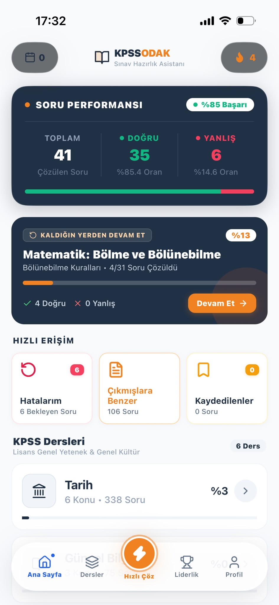

**Özellikler**

- 🏠 Ana sayfa; toplam çözülen soru, doğru ve yanlış sayıları ile başarı oranını tek performans kartında bir araya getirir.
- ✅ Kaldığın Yerden Devam Et kartı, son çalışılan alandaki ilerleme ve sonuçlarla çalışmaya dönüş sağlar.
- ⚡ Hatalarım, Çıkmışlara Benzer ve Kaydedilenler kartları ilgili havuzları açar; alttaki ders kartlarında soru sayıları ve ilerleme görülür.
- 🧭 Alt menü Ana Sayfa, Dersler, Hızlı Çöz, Liderlik ve Profil alanlarına erişim sunar.

---

## 📚 02 · Dersler, konular ve ilerleme

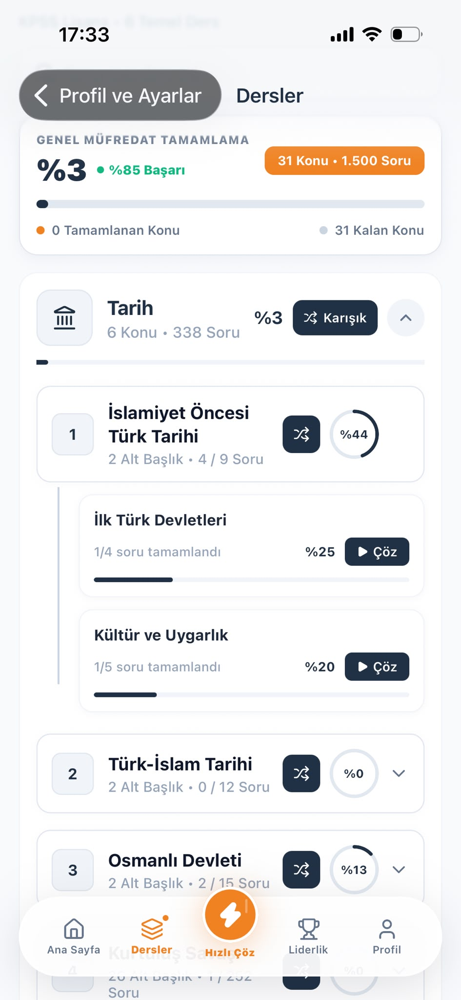

**Özellikler**

- 📚 Dersler ekranının üstünde genel müfredat tamamlanması, başarı oranı ve tamamlanan/kalan konu sayıları bulunur.
- ✅ Açılabilir ders ve konu kartları çalışma başlıklarını düzenli bir hiyerarşide sunar.
- ⚡ Konulardaki dairesel göstergeler ve alt konulardaki ilerleme çubukları tamamlanan soruları gösterir.
- 🧭 Çöz ve Karışık seçenekleriyle aynı alandan hedefli veya daha geniş kapsamlı pratiğe başlanabilir.

---

## ✍️ 03 · Soru çözümü ve cevap değerlendirmesi

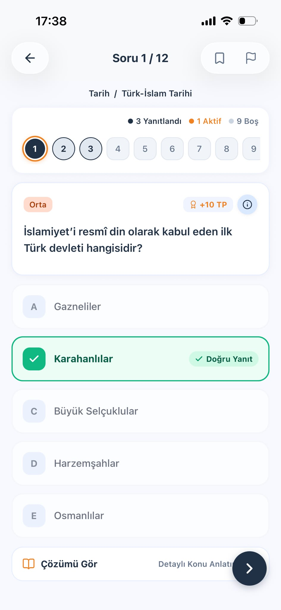

**Özellikler**

- ✍️ Soru çözüm ekranında mevcut soru, ders/konu yolu ve yanıtlanmış, aktif veya boş soruları ayıran numaralı gezinme alanı yer alır.
- ✅ Soru kartında zorluk ve puan bilgisi gösterilir.
- ⚡ Değerlendirme doğru seçeneği belirginleştirir; üst bölümde soru kaydetme ve bildirme eylemleri bulunur.
- 🧭 Çözümü Gör alanı açıklamaya erişim sağlar, sonraki soru kontrolü oturumu sürdürür.

---

## 📊 04 · Soru istatistikleri

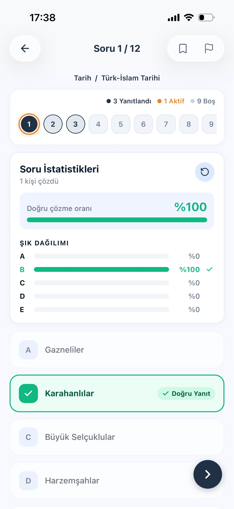

**Özellikler**

- 📊 İstatistik görünümü soruyu kaç kişinin çözdüğünü, doğru çözme oranını ve A–E seçeneklerinin tercih dağılımını sunar.
- ✅ Çubuklar şık dağılımını karşılaştırmayı kolaylaştırır; doğru cevap ayrıca işaretlenir.
- ⚡ Üstteki numaralı soru gezinmesi görünmeye devam ederek istatistik incelenirken soru bağlamını korur.

---

## 🎯 05 · Hata havuzu ve hedefli tekrar

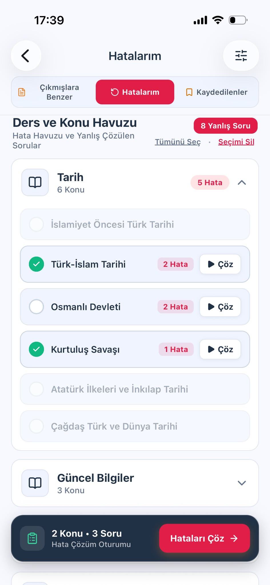

**Özellikler**

- 🎯 Hatalarım sekmesi yanlış cevaplanan soruları ders ve konu bazında gruplar.
- ✅ Her konunun hata sayısı ve doğrudan Çöz eylemi bulunur; kullanılabilir hatası olmayan konular pasif görünür.
- ⚡ Birden fazla konu seçilebilir, tümü seçilebilir veya seçim temizlenebilir.
- 🧭 Alttaki özet, hata çözüm oturumu başlamadan seçilen konu ve soru sayısını gösterir.

---

## 📝 06 · Çıkmışlara benzer sorular ve özel test

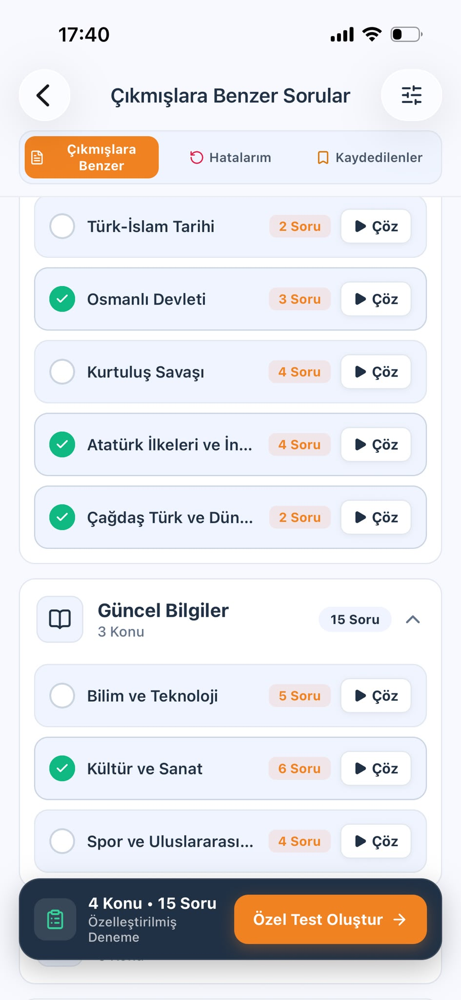

**Özellikler**

- 📝 Çıkmışlara Benzer sekmesi dersleri ve konuları kullanılabilir soru sayılarıyla listeler.
- ✅ Konuların yanındaki Çöz düğmeleri doğrudan konu çalışmasını başlatır.
- ⚡ Birden fazla konu seçildiğinde özel bir soru grubu hazırlanır; alttaki çubuk seçimin kapsamını gösterir ve Özel Test Oluştur eylemini sunar.
- 🧭 Aynı gezinme alanından Hatalarım ve Kaydedilenler sekmelerine geçilebilir.

---

## 🔎 07 · Soru filtreleri

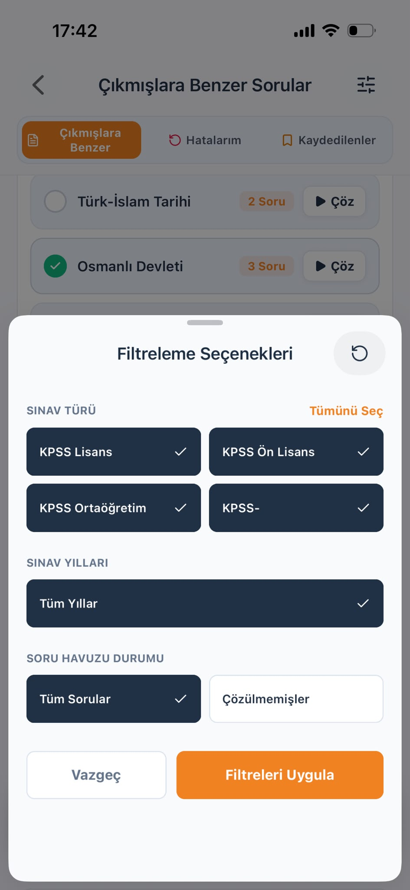

**Özellikler**

- 🔎 Filtreleme penceresinde sınav türleri ve yılları seçilebilir; tüm sorular veya çözülmemiş sorular arasında tercih yapılabilir.
- ✅ Seçilen seçenekler belirgin biçimde işaretlenir.
- ⚡ Tümünü Seç, sıfırlama, Vazgeç ve Filtreleri Uygula kontrolleri, hangi seçimlerin soru havuzuna uygulanacağını anlaşılır kılar.

---

## 🔥 08 · Çalışma serisi ve aktivite takvimi

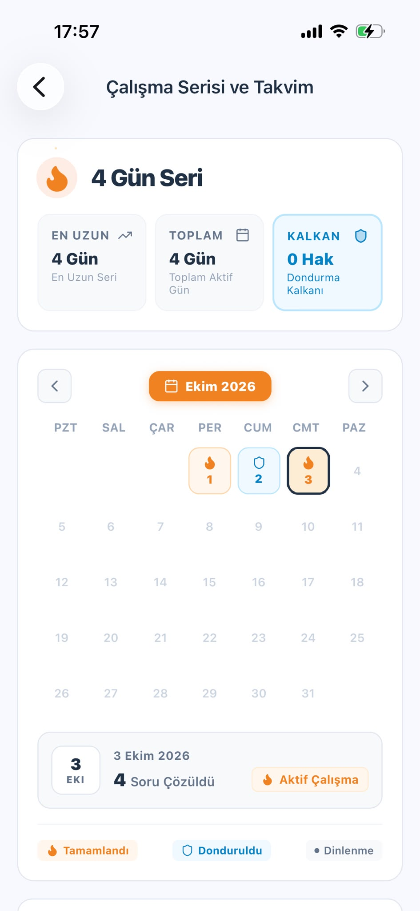

**Özellikler**

- 🔥 Çalışma takvimi mevcut seri, en uzun seri, toplam aktif gün ve kalan dondurma kalkanını gösterir.
- ✅ Ay gezinmesiyle farklı dönemler incelenebilir.
- ⚡ Tamamlanan, dondurulan ve dinlenme günleri farklı simge ve renklerle ayrılır.
- 🧭 Bir gün seçildiğinde tarihi, çözülen soru sayısı ve aktivite durumu görüntülenir.

---

## 🏆 09 · Haftalık ve tüm zamanlar sıralaması

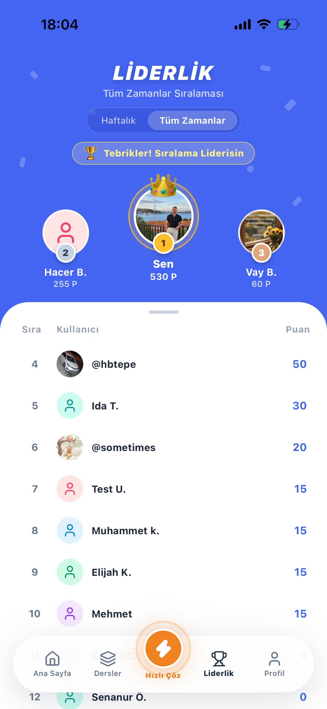

**Özellikler**

- 🏆 Liderlik ekranında haftalık ve tüm zamanlar görünümleri arasında geçiş yapılır.
- ✅ Podyum ilk üç kullanıcıyı profil görselleri ve puanlarıyla öne çıkarır; alt liste diğer sıraları gösterir.
- ⚡ Öğrencinin kendi konumu podyumda veya sıralama bağlamında vurgulanarak rekabetteki gelişimini takip etmesi kolaylaştırılır.

---

## 🖥️ 10 · Web yönetim paneli

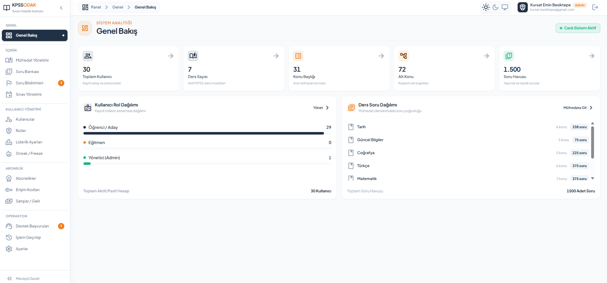

**Özellikler**

- 🖥️ Genel Bakış ekranında toplam kullanıcı, ders, konu, alt konu ve soru havuzu büyüklüğü gösterilir.
- ✅ Rol dağılımı öğrenci, eğitmen ve yöneticileri ayırır; ders dağılımı müfredattaki soru yoğunluğunu gösterir.
- ⚡ Özet kartlarından ilgili yönetim alanlarına geçilebilir.
- 🧭 Yan menü içerik, kullanıcı yönetimi, abonelik ve operasyon alanlarını gruplar; soru bildirimleri ile destek başvurularında bekleyen kayıt rozetleri bulunur.
- 🖥️ Üst bölüm gezinme bağlamını, görünüm seçeneklerini ve oturumdaki personel hesabını gösterir.

---

## 🎛️ Yönetim alanları

### 📊 01 · Genel Bakış

- 📊 Özet kartları kullanıcı, ders, konu, alt konu ve soru havuzu büyüklüğünü gösterir.
- ✅ Rol dağılımı kullanıcı kitlesini, ders dağılımı soruların müfredattaki yoğunluğunu görünür kılar.
- ⚡ Kartlardan ve dağılım alanlarından ilgili yönetim sayfalarına geçilir.

---

### 📚 02 · Müfredat Yönetimi

- 📚 Dersler, konular ve alt konular oluşturulur ve düzenlenir; gösterim sırası ve aktiflik yönetilir.
- ✅ Başlık güncellemeleri mevcut soru ilişkilerini korur.
- ⚡ Hiyerarşi, genel dersten belirli çalışma alanına düzenli bir geçiş sağlar.

---

### 📝 03 · Soru Bankası

- 📝 Soru metni, beş seçenek, doğru cevap, çözüm açıklaması ve isteğe bağlı görsel hazırlanır.
- ✅ Sınav türü, kaynak, yıl, zorluk, hedef süre ve puan bilgileri düzenlenir.
- ⚡ Arama ve filtreler içerik bulmayı kolaylaştırır; müfredat alanlarında soru sayıları görülebilir.
- 🧭 Sorular taslak kaydedilebilir veya yayımlanabilir.
- 📝 Zorluk öğrenci sonuçlarına göre veya elle belirlenir; değerlendirme bilgileri incelenmesi gereken soruları fark etmeyi sağlar.

---

### 🚩 04 · Soru Bildirimleri

- 🚩 Öğrenci bildirimleri ayrı inceleme alanında aranır ve filtrelenir.
- ✅ Yeni, inceleniyor ve sonuçlandı durumları süreci takip eder.
- ⚡ İnceleme alanından tam soru düzenleyicisine erişilerek içerik düzeltilebilir; bildirim geçmişi korunur.
- 🧭 Açık bildirim sayısı menüde gösterilir.

---

### 🗓️ 05 · Sınav Yönetimi

- 🗓️ Sınav türleri ve takvim kayıtları; başlık, tarih, sıra ve aktiflik bilgileriyle yönetilir.
- ✅ Takvim kayıtları pasife alınabilir ve tekrar etkinleştirilebilir.
- ⚡ Öğrencilerin sınav bilgileri ve geri sayımları bu kayıtlar üzerinden sunulur.

---

### 👥 06 · Kullanıcılar

- 👥 Arama, rol, hesap durumu ve paket filtreleri kullanıcıya ulaşmayı kolaylaştırır.
- ✅ Hesap oluşturma ve düzenleme, rol atama ve aktiflik yönetimi yapılır.
- ⚡ Sayaçlar öğrenci, eğitmen ve yönetici dağılımını özetler; arayüz CSV dışa aktarma seçeneği sunar.
- 🧭 Kullanıcının paket eylemi mevcut erişimi, atama seçeneklerini ve abonelik geçmişini açar.

---

### 🛡️ 07 · Roller

- 🛡️ Roller ad, açıklama, simge ve yetki seviyesiyle tanımlanır.
- ✅ Yetki kapsamında rol oluşturulur ve düzenlenir.
- ⚡ Varsayılan roller ve kullanıcıların bağlı olduğu roller silinmeye karşı korunur.
- 🧭 Öğrenci kullanımı, eğitmen sorumlulukları ve yönetim bu alanla ayrılır.

---

### 🏆 08 · Liderlik Ayarları

- 🏆 Sıralamaya katılım rol bazında ayrı bir yönetim alanından düzenlenir.
- ✅ Hangi grupların liderlik sıralamasına dahil olacağı belirlenir; öğrenciler mobilde haftalık ve tüm zamanlar sonuçlarını görür.

---

### ❄️ 09 · Streak / Freeze

- ❄️ Yöneticiler kullanıcı aktivitesini, günlük sonuçları, aylık takvimi, seri durumunu ve koruma haklarını inceler.
- ✅ Arama ve filtrelerle kapsam daraltılır.
- ⚡ Tekil veya toplu koruma hakkı tanımlama ve uygun kesinti telafileri, onay öncesi önizlemeyle değerlendirilir.
- 🧭 İşlem geçmişi sonuçları takip eder ve tamamlanan veya kesintiye uğrayan çalışmanın izlenmesini sağlar.

---

### 💎 10 · Abonelikler

- 💎 Paketler ve özellikler ayrı yönetilir; eşleştirilerek her paketin kapsamı belirlenir.
- ✅ Varsayılan paket, aktiflik ve kullanım bilgileri düzenlenir.
- ⚡ Kullanıcıya erişim atanabilir, süre uzatılabilir, paket değiştirilebilir veya iptal edilebilir; önceki dönemler geçmişte kalır.
- 🧭 Paketlere bağlı mağaza teklifleri de yönetilebilir.

---

### 🔑 11 · Erişim Kodları

- 🔑 Tekil veya toplu kampanya kodları oluşturulur, erişim paketle ilişkilendirilir.
- ✅ Kodlar aranır ve filtrelenir; kullanım geçmişi incelenir.
- ⚡ Kod geçici kapatılabilir veya gerekçeyle iptal edilebilir.
- 🧭 Öğrenci kodu paket alanında kullanır; verilen erişim ve kod geçmişi mağaza satın alımlarından ayrı takip edilir.

---

### 💰 12 · Satışlar / Gelir

- 💰 Mağaza abonelik hareketleri dönem, platform, paket ve olay türüne göre incelenir.
- ✅ Raporlarda para birimine göre brüt tutarlar, iadeler ve eğilimler gösterilir.
- ⚡ Test mağazası olayları gerçek satış toplamlarına dahil edilmez.
- 🧭 Kampanya kodları ve yönetici atamaları mağaza satışı sayılmaz.

---

### 💬 13 · Destek Başvuruları

- 💬 Liste ve inceleme alanını bir araya getiren çalışma alanında bekleyen/sonuçlanan sayaçları ve menü rozeti bulunur.
- ✅ Ekip ilk başvuruyu ve ek mesajı okuyabilir, yanıt yazabilir ve başvuruyu sonuçlandırabilir.
- ⚡ Yanıt daha sonra güncellenebilir; düzenleme zamanı gösterilir.
- 🧭 Öğrenci cevabı kendi başvuru geçmişinden okur.

---

### 🕘 14 · İşlem Geçmişi

- 🕘 Kaydedilen yönetim değişiklikleri kişi, tarih, modül ve işlem türüne göre filtrelenir.
- ✅ Ayrıntılar etkilenen alanı ve uygun kayıtlar için eski/yeni değerleri gösterir.
- ⚡ Kullanıcılar, roller, içerikler, abonelikler, kodlar ve diğer alanlardaki değişiklikler izlenir; geçmiş düzenlenebilir bir çalışma alanı olarak kullanılmaz.

---

### ⚙️ 15 · Ayarlar ve panel kullanımı

- ⚙️ Panelde Ayarlar alanı, açık/koyu/sistem görünümü, daraltılabilir yan menü ve konumu gösteren gezinme yolu bulunur.
- ✅ Bekleyen kayıt rozetleri operasyonel işleri görünür kılar.
- ⚡ Oturumdaki personel hesabı ve çıkış eylemi üst bölümde yer alır.
- 🧭 Modüllere erişim personelin yetkilerine göre düzenlenir.

---

# 🛠️ Teknolojiler ve mimari

- 📱 **Mobil:** React Native · Expo · TypeScript
- 🖥️ **Web:** React · Vite · Tailwind CSS · TypeScript
- ⚙️ **Sunucu:** .NET 9 · C# · ASP.NET Core · Entity Framework Core
- 🗄️ **Veri tabanı:** SQL Server

Mobil uygulama ve web paneli aynı sunucuyu kullanır. API, Application, Domain ve Infrastructure katmanları istekleri, iş akışlarını, temel varlıkları ve veri erişimini ayırır. Personelin yönetim yetkileri ile öğrencinin paket erişimi ayrı değerlendirilir.

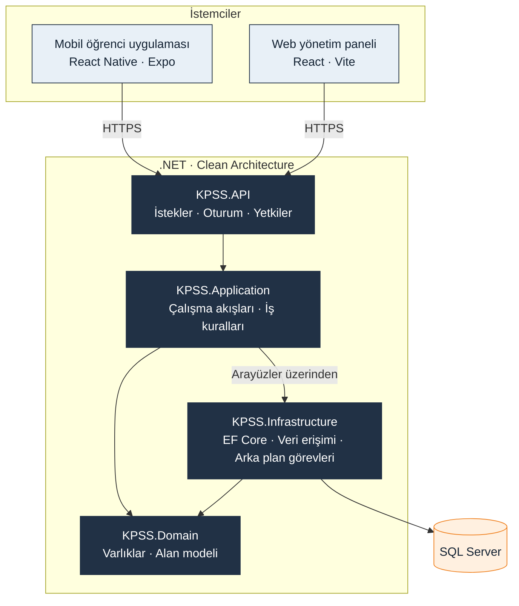

## 🔄 Cevap ve ilerleme akışı

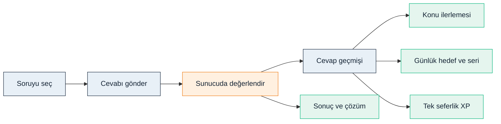

Sunucu cevabı değerlendirir, denemeyi kaydeder ve konu ilerlemesini, günlük aktiviteyi ve uygun XP kazanımını günceller. Tekrar çözümleri tekil soru tamamlanmasını artırmaz; ilk doğru çözüm için puan bir kez kazanılır. Hata havuzu öğrencinin en son cevabına göre oluşur.

# 🗃️ Veri tabanı tasarımı

### Sorumlulukları ayrılmış ilişkisel veri modeli

Uygulama verileri SQL Server'da tutulur; model ve sürüm değişiklikleri Entity Framework Core üzerinden yönetilir. Aşağıdaki dört diyagram, belgelenmiş tasarımın seçilmiş varlıklarını ve temel alanlarını gösterir. Üretimdeki bütün sütunların dökümü yerine ilişkileri okunabilir biçimde sunar.

**PK** birincil anahtar, **FK** yabancı anahtar, **UK** benzersiz anahtardır. Daire isteğe bağlı ilişkiyi, çatallı uç çok sayıda kaydı gösterir. Alan tipleri sadeleştirilmiştir; isteğe bağlı kimlik alanları belirtilmiştir.

### 📚 1 · Müfredat ve soru içeriği

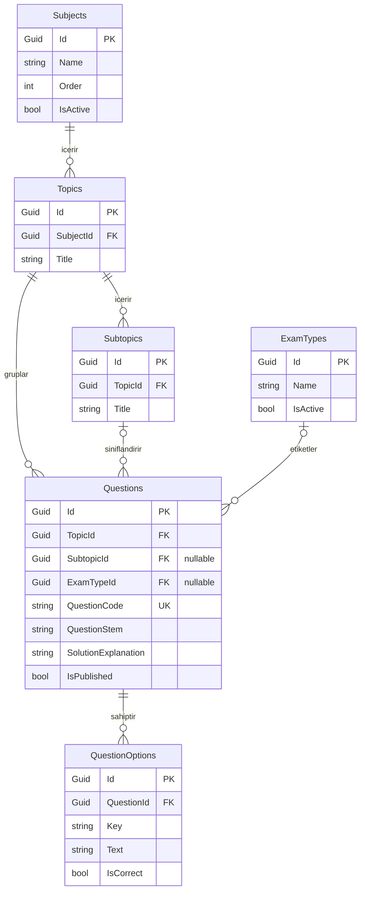

 Subjects → Topics → Subtopics yapısı ders, konu ve alt konu düzenini kurar. Her soru bir konuya bağlıdır; alt konu ve sınav türü isteğe bağlıdır. QuestionOptions, seçenekleri soru metninden ayrı kayıtlar halinde tutar.

QuestionCode, yönetim ve bildirim süreçlerinde kullanılabilecek benzersiz soru referansıdır. Soru kaydı ayrıca kaynak, yıl, zorluk, hedef süre, XP, çözüm ve yayın bilgilerini taşır.

**Sınav takvimi:** ExamSchedules tarihleri, başlıkları ve aktifliği saklar. Belgelenen tasarımda sınav türü ile takvim ortak kod üzerinden eşleşir; mevcut olmayan bir yabancı anahtar bağlantısı çizilmemiştir.

### 📈 2 · Öğrenci pratiği, ilerleme ve motivasyon

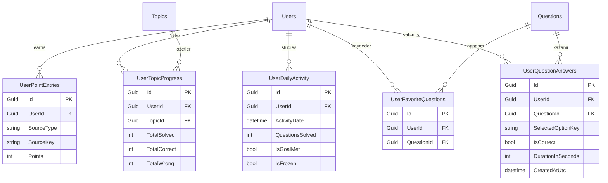

 UserQuestionAnswers her cevap denemesini ve çözüm süresini saklar. UserTopicProgress konudaki gelişimi özetler. UserDailyActivity çalışma günlerini ve günlük hedef durumunu temsil eder. UserPointEntries XP kazanımlarını, UserFavoriteQuestions ise kaydedilen soruları tutar.

Bu ayrım, geçmiş cevapları değiştirmeden konu ilerlemesini ve günlük çalışma alışkanlığını ayrı ayrı değerlendirmeyi sağlar.

**Tekil ilerleme:** aynı soru yeniden çözüldüğünde yeni bir soru gibi sayılmaz.  
**Hata havuzu:** öğrencinin son cevabına göre hesaplanır; ayrı bir yanlışlar tablosu kullanılmaz.  
**XP tutarlılığı:** soru yalnız ilk doğru çözümde puan kazandırır; puan kaynağı üzerinden mükerrer kazanım engellenir.  
**Seri takibi:** günlük aktivite ve kullanıcının seri/koruma değerleri takvimi ve ara verilen günlerin korunmasını destekler.

### 🔐 3 · Roller, paketler ve özellik erişimi

 Roles yönetim yetkisini ve sıralamaya katılımı tanımlar. SubscriptionPlans paketleri, Features erişilebilen özellikleri temsil eder. PlanFeatures iki alanı bağlayarak bir pakete birden fazla özellik, bir özelliğe de birden fazla paket tanımlanmasını sağlar.

UserSubscriptions kullanıcının paket dönemlerini saklar. Başlangıç, bitiş ve iptal bilgileri geçmişi korur. Güncel erişim geçmiş atamalardan ayrı değerlendirilir; kullanıcı başına tek güncel abonelik kuralı uygulanır.

**Yetki ve erişim ayrımı:** rol, personelin neleri yönetebileceğini; paket, öğrencinin hangi özellikleri kullanabileceğini belirler.  
**İlişki bütünlüğü:** aynı paket-özellik eşleşmesi tekrar oluşturulmaz. Bağlantılı paket ve özellikler kontrolsüz biçimde silinmez; geçmiş kullanımı olan paket gerektiğinde arşivlenir.  
**Ek yönetim alanları:** StoreOffers mağaza tekliflerini, RedeemCodes ve CodeRedemptions kampanya kodları ile kullanım geçmişini, StoreBillingEvents doğrulanmış mağaza olaylarını tutar. Kampanya erişimi mağaza satışı olarak kaydedilmez.

### 🚩 4 · Geçmişini koruyan soru bildirimleri

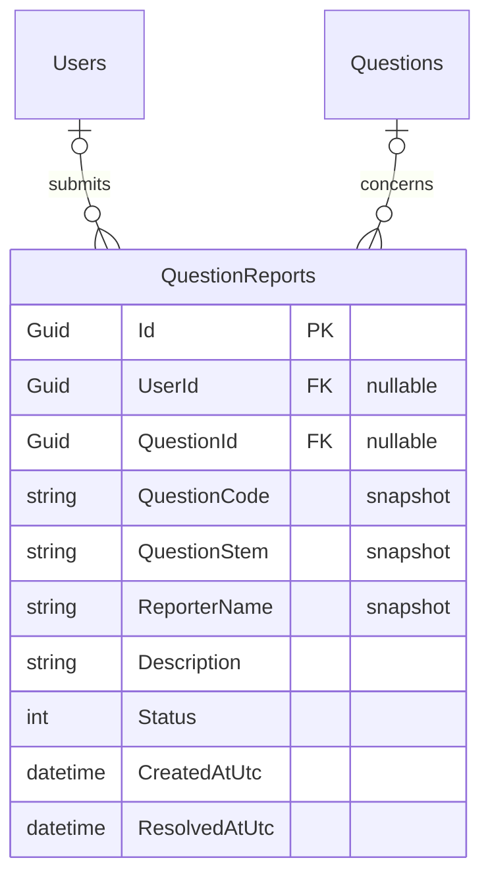

 QuestionReports öğrenciye ve soruya isteğe bağlı bağlantılar taşır. Aynı zamanda soru kodu, soru metni ve bildiren kişinin adı gibi anlık görüntüleri saklar. Soru veya kullanıcı kaldırıldığında ilişki boşalabilir; bildirimin geçmişi korunur.

Aynı kullanıcı ve soru için açık bildirim tekrarı engellenir. Yeni, inceleniyor ve sonuçlandı durumları inceleme sürecini takip eder. Sonuçlanan bildirim geçmişte kalırken ilgili soru düzenlenmeye devam edebilir.

### Diğer yönetim kayıtları

**SupportRequests** destek başvurularını, ek mesajları ve ekip yanıtlarını tutar. **AdminAuditLogs** kaydedilen yönetim değişikliklerinin kim tarafından, ne zaman ve hangi alanda yapıldığını gösterir. **StreakAdminOperations** ve **StreakAdminOperationItems**, tekil veya toplu seri işlemlerinin önizlemesini ve kullanıcı bazlı sonuçlarını saklar.

Destek görüşmeleri, içerik incelemesi ve yönetim işlemleri farklı yaşam döngülerine sahip olduğu için öğrenme kayıtlarından ayrı ele alınır.

### Tutarlılık ve geçmişin korunması

- Guid kimlikler ilişkileri kurar; benzersiz kod ve adlar kayıtları tutarlı biçimde tanımlar.
- Zorunlu ve isteğe bağlı bağlantılar içerik kurallarını yansıtır.
- İşlemlerin birlikte tamamlanması ve kullanıcı bazlı koordinasyon, paket ataması ve kod kullanımı gibi süreçleri korur.
- Tekrarlanan istekler aynı erişimi veya puanı yeniden üretmez.
- Güncel durum değişirken abonelik, kod kullanımı, mağaza olayları ve yönetim geçmişi korunur.
- Soru zorluğu farklı öğrencilerin geçerli ilk cevaplarından, yeterli örneklem oluştuğunda hesaplanır; elle yönetim seçeneği de bulunur.

<strong>🇬🇧 English</strong>

<strong>📱 Mobile student app · 🖥️ Web management portal · 🗓️ 2026</strong>

## 🎯 Purpose

KPSS ODAK brings question practice, curriculum progress, focused revision and study habits together for candidates preparing for Türkiye's Public Personnel Selection Examination. A mobile student application is supported by a web portal for content, users, access packages and daily operations.

---

# 📱 Application screens

## 🏠 01 · Home and performance overview

**Features**

- 🏠 The home screen brings solved-question totals, correct and incorrect counts, and success rate together in one performance card.
- ✅ A continuation card returns the student to the last study area, with its current completion and results.
- ⚡ Quick-access cards open Mistakes, Questions Similar to Past Exams and Saved Questions; subject cards below show their question counts and progress.
- 🧭 The bottom navigation keeps Home, Subjects, Quick Solve, Leaderboard and Profile within reach.

---

## 📚 02 · Subjects, topics and progress

**Features**

- 📚 The Subjects screen starts with overall curriculum completion, accuracy, and completed or remaining topics.
- ✅ Expandable subject and topic cards expose the learning hierarchy.
- ⚡ Circular topic indicators and subtopic progress bars show completed questions, while Solve and Mixed buttons let students begin focused or broader practice from the same area.

---

## ✍️ 03 · Question solving and answer feedback

**Features**

- ✍️ The solving screen shows the current question, subject/topic path and a numbered navigator that distinguishes answered, active and blank questions.
- ✅ The question card includes difficulty and points.
- ⚡ Answer feedback highlights the correct option, while Save and Report actions remain available in the header.
- 🧭 The solution entry opens the explanation, and the next-question control continues the session.

---

## 📊 04 · Question statistics

**Features**

- 📊 The statistics view presents how many people solved the question, its correct-answer rate and the distribution of choices A–E.
- ✅ Bars make the distribution easy to compare, and the correct answer is clearly marked.
- ⚡ The numbered question navigator remains visible above, so the student retains context while reviewing the statistics.

---

## 🎯 05 · Mistake pool and focused revision

**Features**

- 🎯 The Mistakes tab groups incorrectly answered questions by subject and topic.
- ✅ Each topic shows its mistake count and a direct Solve action; topics without available mistakes appear inactive.
- ⚡ Students can select several topics, select all or clear the selection.
- 🧭 The bottom summary updates the selected topic/question totals before starting a mistake-review session.

---

## 📝 06 · Past-exam-style questions and custom practice

**Features**

- 📝 The Past-Exam-Style Questions tab lists subjects and topics with available question counts.
- ✅ Individual Solve buttons start a topic session.
- ⚡ Selecting several topics builds a custom practice set; the bottom bar shows its scope and provides the Create Custom Test action.
- 🧭 The same navigation also leads to Mistakes and Saved Questions.

---

## 🔎 07 · Question filters

**Features**

- 🔎 The filter sheet lets students select exam types and years and choose between all questions or unanswered questions.
- ✅ Selected options are visibly marked.
- ⚡ Select All, reset, Cancel and Apply Filters controls make it clear which changes will affect the question pool.

---

## 🔥 08 · Study streak and activity calendar

**Features**

- 🔥 The study calendar shows the current streak, longest streak, total active days and remaining freeze protection.
- ✅ Month navigation lets students inspect earlier or later periods.
- ⚡ Completed, frozen and rest days use distinct symbols and colors.
- 🧭 Selecting a day reveals its date, solved-question count and activity state.

---

## 🏆 09 · Weekly and all-time leaderboard

**Features**

- 🏆 The Leaderboard screen switches between weekly and all-time views.
- ✅ A podium highlights the top three users with avatars and points; the list below presents the remaining ranks.
- ⚡ The current student's position is called out in the podium or ranking context, making progress in the competition easy to follow.

---

## 🖥️ 10 · Web administration dashboard

**Features**

- 🖥️ The overview screen shows total users, subjects, topics, subtopics and question-bank size.
- ✅ Role distribution separates students, instructors and administrators; subject distribution shows question density across the curriculum.
- ⚡ Quick links lead from the summary cards to management areas.
- 🧭 The sidebar groups content, user management, subscriptions and operations, with badges for pending question reports and support requests.
- 🖥️ The header shows navigation context, appearance controls and the current staff account.

---

## 🎛️ Management modules

### 📊 01 · General overview

- 📊 Summary cards show users, subjects, topics, subtopics and question-bank size.
- ✅ Role distribution shows the composition of the user base, while subject distribution shows where questions are concentrated.
- ⚡ Links from cards and distribution sections lead into the relevant management areas.

---

### 📚 02 · Curriculum management

- 📚 Staff create and maintain subjects, topics and subtopics, arrange their display order and control availability.
- ✅ Updating a curriculum title preserves its existing question relationships.
- ⚡ The hierarchy provides a clear route from broad subjects to specific practice areas.

---

### 📝 03 · Question bank

- 📝 The panel supports question text, five choices, the correct answer, explanation and optional visual content.
- ✅ Exam type, source, year, difficulty, target duration and points can be maintained.
- ⚡ Staff search and filter content, inspect curriculum question counts, and save questions as drafts or publish them.
- 🧭 Difficulty can use student answer results or a manual selection; review information helps identify unusually difficult questions.

---

### 🚩 04 · Question reports

- 🚩 Student reports are searched and filtered in a dedicated review queue.
- ✅ New, under-review and resolved states track the workflow.
- ⚡ The full question editor is accessible from the review area, allowing content correction without losing the original report history.
- 🧭 Pending counts appear in the menu.

---

### 🗓️ 05 · Exam management

- 🗓️ Staff manage exam types and calendar records, including titles, dates, ordering and availability.
- ✅ Calendar entries can be deactivated and reactivated.
- ⚡ These records supply the exam information and countdowns used by students.

---

### 👥 06 · Users

- 👥 Search and role, status and package filters help staff locate users.
- ✅ Accounts can be created and edited, with role and active status maintained.
- ⚡ User counters summarize students, instructors and administrators, and the interface provides CSV export.
- 🧭 A user's package action opens current access, assignment controls and subscription history.

---

### 🛡️ 07 · Roles

- 🛡️ Roles have a name, description, icon and permission level.
- ✅ Staff can create and edit roles within their permissions.
- ⚡ Default roles and roles assigned to users are protected from deletion.
- 🧭 This separates student participation, instructional responsibilities and administration.

---

### 🏆 08 · Leaderboard settings

- 🏆 Leaderboard eligibility is controlled per role in a separate management area.
- ✅ Staff determine which groups participate in ranking, while students see weekly and all-time results in the mobile application.

---

### ❄️ 09 · Study streak and freeze protection

- ❄️ Administrators review user activity, daily results, monthly calendars, streak status and protection balances.
- ✅ Search and filters narrow the group.
- ⚡ Individual or bulk protection grants and eligible interruption compensation are previewed before confirmation.
- 🧭 Operation history tracks outcomes and supports following up completed or interrupted work.

---

### 💎 10 · Subscriptions and feature access

- 💎 Packages and features are maintained separately, then connected to define what each package includes.
- ✅ Administrators set the default package, manage availability and review usage.
- ⚡ User access can be assigned, extended, changed or cancelled, keeping previous periods in history.
- 🧭 Store offers attached to packages can also be managed.

---

### 🔑 11 · Access codes

- 🔑 Administrators create individual or batch promotional codes, associate access with a package, search and filter codes, inspect usage history, temporarily deactivate codes or revoke them with a reason.
- ✅ Students redeem codes from their package area; granted access and code history remain distinguishable from store purchases.

---

### 💰 12 · Sales and revenue

- 💰 Store subscription events can be reviewed by period, platform, package and event type.
- ✅ Reports show currency-specific gross amounts, refunds and trends.
- ⚡ Test-store events are excluded from real sales totals.
- 🧭 Promotional codes and administrative grants are not classified as store sales.

---

### 💬 13 · Support requests

- 💬 The workspace combines a request list with an inspection area, pending/resolved counters and a menu badge.
- ✅ Staff read the original request and follow-up message, reply and resolve the case.
- ⚡ A staff reply can be edited later, with its update time shown.
- 🧭 Students read the response in their own request history.

---

### 🕘 14 · Operation history

- 🕘 Saved management changes can be filtered by actor, date, module and action.
- ✅ Details show the affected area and previous/new values where appropriate.
- ⚡ This supports reviewing changes across users, roles, content, subscriptions, access codes and other managed areas without turning the log into an editable workspace.

---

### ⚙️ 15 · Settings and panel navigation

- ⚙️ The panel provides a settings area, light/dark/system appearance controls, a collapsible sidebar and breadcrumb navigation.
- ✅ Pending-report badges keep operational work visible.
- ⚡ The current staff account and sign-out action remain in the header.
- 🧭 Module access follows the staff member's permissions.

---

# 🛠️ Technologies and architecture

- 📱 **Mobile:** React Native · Expo · TypeScript
- 🖥️ **Web:** React · Vite · Tailwind CSS · TypeScript
- ⚙️ **Backend:** .NET 9 · C# · ASP.NET Core · Entity Framework Core
- 🗄️ **Database:** SQL Server

The mobile application and web portal share one backend. API, Application, Domain and Infrastructure layers separate requests, business workflows, core entities and persistence. Staff permissions and student package access are evaluated separately.

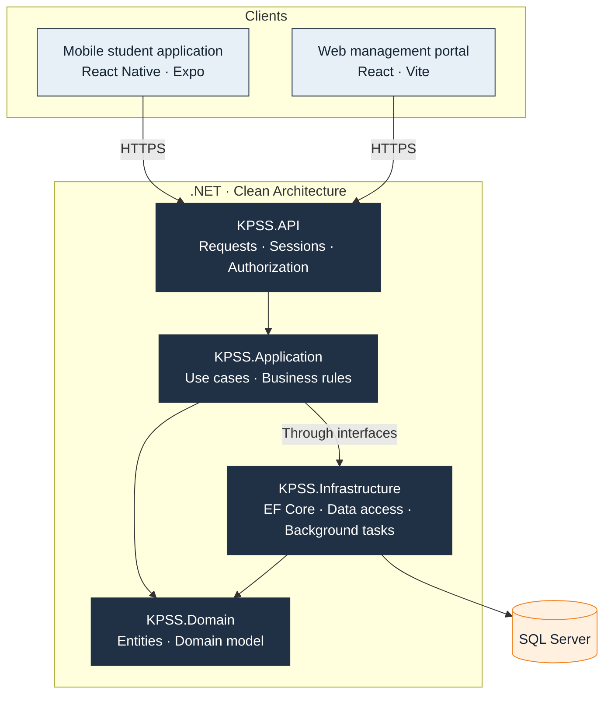

## 🔄 Answer and progress workflow

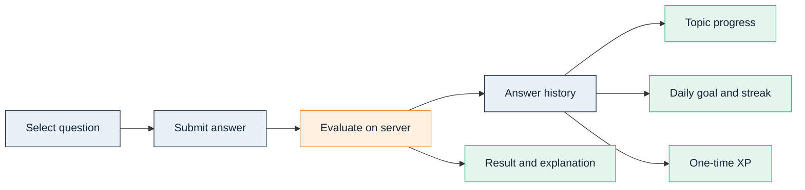

The server evaluates an answer, saves the attempt and updates topic progress, daily activity and eligible XP. Repeated attempts do not inflate distinct-question completion; XP is earned once for the first correct solution. The mistake pool follows the student's latest answer.

# 🗃️ Database design

### A relational model built around separate responsibilities

SQL Server stores the application data, with Entity Framework Core managing the model and migrations. The diagrams below show selected entities and key fields from the documented design. They are a readable overview rather than a complete production schema.

**PK** is a primary key, **FK** a foreign key and **UK** a unique key. A circle marks an optional relationship and a crow's foot marks multiple records. Field types are simplified logical types; optional identifiers are labelled.

### 📚 1 · Curriculum and question content

A subject contains topics, and a topic contains subtopics. Each question belongs to a topic; its subtopic and exam type are optional. Keeping answer choices in QuestionOptions allows question text, choices, explanations and publication status to be maintained as one content unit.

QuestionCode provides a stable, unique reference for administration and reporting. Questions also carry source, year, difficulty, target duration and XP information beyond the fields shown here.

**Exam calendar:** ExamSchedules stores dates, titles and availability. The documented calendar matches exam types through a shared code; it is not presented here as a foreign-key relationship.

### 📈 2 · Student practice, progress and motivation

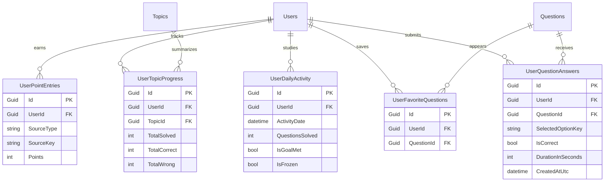

UserQuestionAnswers keeps individual attempts and solving duration. UserTopicProgress summarizes progress per topic; UserDailyActivity represents study days and daily goals. UserPointEntries records XP awards, while UserFavoriteQuestions connects a student to saved questions.

These records answer different questions: “What did the student answer?”, “How far has the topic progressed?”, “Was today's goal met?” and “Why was XP awarded?”

**Distinct progress:** repeated attempts do not count as new questions for completion.  
**Mistake review:** the latest answer determines whether a question belongs in the mistake pool; the pool is derived from answers rather than a separate mistakes table.  
**XP consistency:** the first correct solution awards question XP once, with source-based uniqueness preventing repeated awards.  
**Streak continuity:** daily activity and the user's streak/protection values support the study calendar and missed-day protection.

### 🔐 3 · Roles, packages and feature access

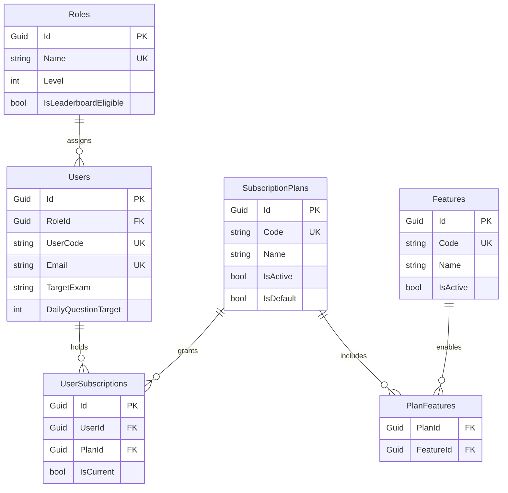

Roles describe management authority and leaderboard eligibility. SubscriptionPlans describe packages. PlanFeatures joins packages and Features, allowing multiple features per package and multiple packages per feature.

UserSubscriptions links users to package periods. Start, end and cancellation information keep previous periods available; current access is determined separately from historical assignments. A filtered uniqueness rule permits only one current subscription per user.

**Separate decisions:** a role determines what a staff member can manage; a package determines which student features can be used. Package names do not replace permission checks.  
**Relationship integrity:** duplicate package-feature links are prevented, and referenced packages/features cannot simply be removed. Historical usage may lead to archiving instead of deleting a package.  
**Operational extensions:** StoreOffers describes store products attached to plans. RedeemCodes and CodeRedemptions support promotional access and its usage history. StoreBillingEvents records verified store lifecycle events separately from promotional grants.

### 🚩 4 · Question reports that preserve their history

A report may refer to a student and question while also keeping snapshots of the question reference, text and reporter name. If either referenced record is removed, its link can become empty while the report remains useful for historical review.

Open reports are protected against duplicate submissions for the same student and question. Staff move reports through new, under-review and resolved states. A resolved report stays in history, while the related question can still be maintained.

### Other management records

**SupportRequests** keeps support requests, follow-up messages and staff replies. **AdminAuditLogs** tracks saved management changes and supports reviewing the actor, time, target and changed information. **StreakAdminOperations** and **StreakAdminOperationItems** record previews and the outcomes of individual or bulk streak operations.

These records are intentionally described separately from the learning model: support conversations, content review and administrative operations have different lifecycles.

### Integrity and history

- Guid identifiers connect records; unique codes and names identify items consistently.
- Required and optional relationships reflect real content rules, such as questions without an exam type.
- Transactions and user-level coordination protect operations such as subscription assignment and code redemption.
- Repeated requests are handled without granting the same access or award twice.
- Subscription, code usage, store event and management histories remain available as current state changes.
- Question difficulty uses valid first answers from distinct students, with a minimum sample size and manual override support.

