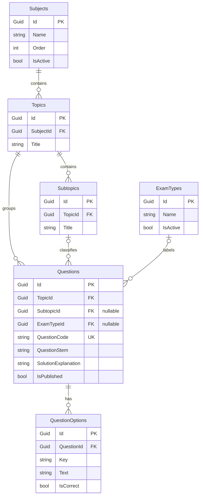
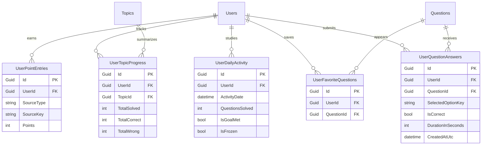
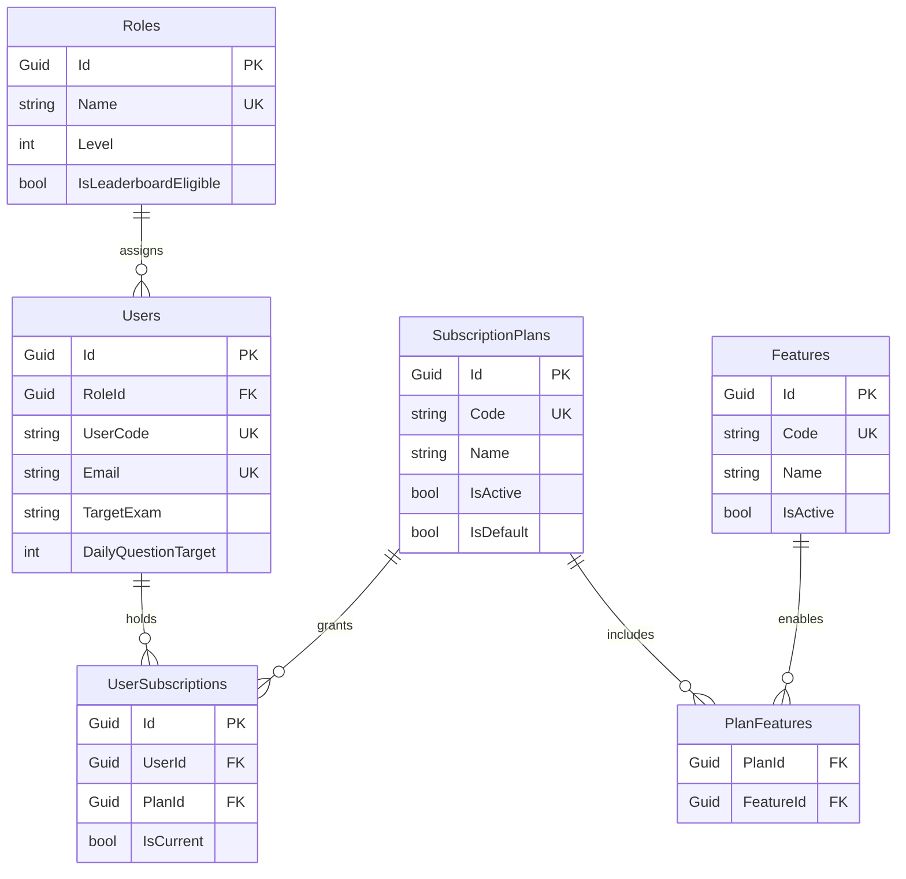
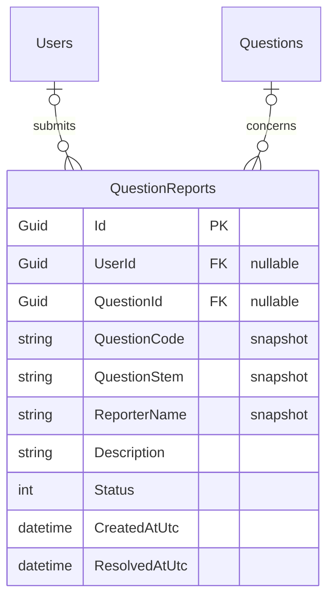

# Database design / Veritabanı tasarımı

[Back to showcase / Tanıtıma dön](../README.md) · [English](#english) · [Türkçe](#türkçe)

## English

### A relational model built around separate responsibilities

SQL Server stores the application data, with Entity Framework Core managing the model and migrations. The diagrams below show selected entities and key fields from the documented design. They are a readable overview rather than a complete production schema.

**PK** is a primary key, **FK** a foreign key and **UK** a unique key. A circle marks an optional relationship and a crow's foot marks multiple records. Field types are simplified logical types; optional identifiers are labelled.

#### 1. Curriculum and question content

A subject contains topics, and a topic contains subtopics. Each question belongs to a topic; its subtopic and exam type are optional. Keeping answer choices in QuestionOptions allows question text, choices, explanations and publication status to be maintained as one content unit.

QuestionCode provides a stable, unique reference for administration and reporting. Questions also carry source, year, difficulty, target duration and XP information beyond the fields shown here.

**Exam calendar:** ExamSchedules stores dates, titles and availability. The documented calendar matches exam types through a shared code; it is not presented here as a foreign-key relationship.

#### 2. Student practice, progress and motivation

UserQuestionAnswers keeps individual attempts and solving duration. UserTopicProgress summarizes progress per topic; UserDailyActivity represents study days and daily goals. UserPointEntries records XP awards, while UserFavoriteQuestions connects a student to saved questions.

These records answer different questions: “What did the student answer?”, “How far has the topic progressed?”, “Was today's goal met?” and “Why was XP awarded?”

**Distinct progress:** repeated attempts do not count as new questions for completion.  
**Mistake review:** the latest answer determines whether a question belongs in the mistake pool; the pool is derived from answers rather than a separate mistakes table.  
**XP consistency:** the first correct solution awards question XP once, with source-based uniqueness preventing repeated awards.  
**Streak continuity:** daily activity and the user's streak/protection values support the study calendar and missed-day protection.

#### 3. Roles, packages and feature access

Roles describe management authority and leaderboard eligibility. SubscriptionPlans describe packages. PlanFeatures joins packages and Features, allowing multiple features per package and multiple packages per feature.

UserSubscriptions links users to package periods. Start, end and cancellation information keep previous periods available; current access is determined separately from historical assignments. A filtered uniqueness rule permits only one current subscription per user.

**Separate decisions:** a role determines what a staff member can manage; a package determines which student features can be used. Package names do not replace permission checks.  
**Relationship integrity:** duplicate package-feature links are prevented, and referenced packages/features cannot simply be removed. Historical usage may lead to archiving instead of deleting a package.  
**Operational extensions:** StoreOffers describes store products attached to plans. RedeemCodes and CodeRedemptions support promotional access and its usage history. StoreBillingEvents records verified store lifecycle events separately from promotional grants.

#### 4. Question reports that preserve their history

A report may refer to a student and question while also keeping snapshots of the question reference, text and reporter name. If either referenced record is removed, its link can become empty while the report remains useful for historical review.

Open reports are protected against duplicate submissions for the same student and question. Staff move reports through new, under-review and resolved states. A resolved report stays in history, while the related question can still be maintained.

### Other management records

**SupportRequests** keeps support requests, follow-up messages and staff replies. **AdminAuditLogs** tracks saved management changes and supports reviewing the actor, time, target and changed information. **StreakAdminOperations** and **StreakAdminOperationItems** record previews and the outcomes of individual or bulk streak operations.

These records are intentionally described separately from the learning model: support conversations, content review and administrative operations have different lifecycles.

### Integrity and history

- Guid identifiers connect records; unique codes and names identify items consistently.
- Required and optional relationships reflect real content rules, such as questions without an exam type.
- Transactions and user-level coordination protect operations such as subscription assignment and code redemption.
- Repeated requests are handled without granting the same access or award twice.
- Subscription, code usage, store event and management histories remain available as current state changes.
- Question difficulty uses valid first answers from distinct students, with a minimum sample size and manual override support.

---

## Türkçe

### Sorumlulukları ayrılmış ilişkisel veri modeli

Uygulama verileri SQL Server'da tutulur; model ve sürüm değişiklikleri Entity Framework Core üzerinden yönetilir. Yukarıdaki dört diyagram, belgelenmiş tasarımın seçilmiş varlıklarını ve temel alanlarını gösterir. Üretimdeki bütün sütunların dökümü yerine ilişkileri okunabilir biçimde sunar.

**PK** birincil anahtar, **FK** yabancı anahtar, **UK** benzersiz anahtardır. Daire isteğe bağlı ilişkiyi, çatallı uç çok sayıda kaydı gösterir. Alan tipleri sadeleştirilmiştir; isteğe bağlı kimlik alanları belirtilmiştir.

### 1. Müfredat ve soru içeriği

**Birinci diyagram:** Subjects → Topics → Subtopics yapısı ders, konu ve alt konu düzenini kurar. Her soru bir konuya bağlıdır; alt konu ve sınav türü isteğe bağlıdır. QuestionOptions, seçenekleri soru metninden ayrı kayıtlar halinde tutar.

QuestionCode, yönetim ve bildirim süreçlerinde kullanılabilecek benzersiz soru referansıdır. Soru kaydı ayrıca kaynak, yıl, zorluk, hedef süre, XP, çözüm ve yayın bilgilerini taşır.

**Sınav takvimi:** ExamSchedules tarihleri, başlıkları ve aktifliği saklar. Belgelenen tasarımda sınav türü ile takvim ortak kod üzerinden eşleşir; mevcut olmayan bir yabancı anahtar bağlantısı çizilmemiştir.

### 2. Öğrenci pratiği, ilerleme ve motivasyon

**İkinci diyagram:** UserQuestionAnswers her cevap denemesini ve çözüm süresini saklar. UserTopicProgress konudaki gelişimi özetler. UserDailyActivity çalışma günlerini ve günlük hedef durumunu temsil eder. UserPointEntries XP kazanımlarını, UserFavoriteQuestions ise kaydedilen soruları tutar.

Bu ayrım, geçmiş cevapları değiştirmeden konu ilerlemesini ve günlük çalışma alışkanlığını ayrı ayrı değerlendirmeyi sağlar.

**Tekil ilerleme:** aynı soru yeniden çözüldüğünde yeni bir soru gibi sayılmaz.  
**Hata havuzu:** öğrencinin son cevabına göre hesaplanır; ayrı bir yanlışlar tablosu kullanılmaz.  
**XP tutarlılığı:** soru yalnız ilk doğru çözümde puan kazandırır; puan kaynağı üzerinden mükerrer kazanım engellenir.  
**Seri takibi:** günlük aktivite ve kullanıcının seri/koruma değerleri takvimi ve ara verilen günlerin korunmasını destekler.

### 3. Roller, paketler ve özellik erişimi

**Üçüncü diyagram:** Roles yönetim yetkisini ve sıralamaya katılımı tanımlar. SubscriptionPlans paketleri, Features erişilebilen özellikleri temsil eder. PlanFeatures iki alanı bağlayarak bir pakete birden fazla özellik, bir özelliğe de birden fazla paket tanımlanmasını sağlar.

UserSubscriptions kullanıcının paket dönemlerini saklar. Başlangıç, bitiş ve iptal bilgileri geçmişi korur. Güncel erişim geçmiş atamalardan ayrı değerlendirilir; kullanıcı başına tek güncel abonelik kuralı uygulanır.

**Yetki ve erişim ayrımı:** rol, personelin neleri yönetebileceğini; paket, öğrencinin hangi özellikleri kullanabileceğini belirler.  
**İlişki bütünlüğü:** aynı paket-özellik eşleşmesi tekrar oluşturulmaz. Bağlantılı paket ve özellikler kontrolsüz biçimde silinmez; geçmiş kullanımı olan paket gerektiğinde arşivlenir.  
**Ek yönetim alanları:** StoreOffers mağaza tekliflerini, RedeemCodes ve CodeRedemptions kampanya kodları ile kullanım geçmişini, StoreBillingEvents doğrulanmış mağaza olaylarını tutar. Kampanya erişimi mağaza satışı olarak kaydedilmez.

### 4. Geçmişini koruyan soru bildirimleri

**Dördüncü diyagram:** QuestionReports öğrenciye ve soruya isteğe bağlı bağlantılar taşır. Aynı zamanda soru kodu, soru metni ve bildiren kişinin adı gibi anlık görüntüleri saklar. Soru veya kullanıcı kaldırıldığında ilişki boşalabilir; bildirimin geçmişi korunur.

Aynı kullanıcı ve soru için açık bildirim tekrarı engellenir. Yeni, inceleniyor ve sonuçlandı durumları inceleme sürecini takip eder. Sonuçlanan bildirim geçmişte kalırken ilgili soru düzenlenmeye devam edebilir.

### Diğer yönetim kayıtları

**SupportRequests** destek başvurularını, ek mesajları ve ekip yanıtlarını tutar. **AdminAuditLogs** kaydedilen yönetim değişikliklerinin kim tarafından, ne zaman ve hangi alanda yapıldığını gösterir. **StreakAdminOperations** ve **StreakAdminOperationItems**, tekil veya toplu seri işlemlerinin önizlemesini ve kullanıcı bazlı sonuçlarını saklar.

Destek görüşmeleri, içerik incelemesi ve yönetim işlemleri farklı yaşam döngülerine sahip olduğu için öğrenme kayıtlarından ayrı ele alınır.

### Tutarlılık ve geçmişin korunması

- Guid kimlikler ilişkileri kurar; benzersiz kod ve adlar kayıtları tutarlı biçimde tanımlar.
- Zorunlu ve isteğe bağlı bağlantılar içerik kurallarını yansıtır.
- İşlemlerin birlikte tamamlanması ve kullanıcı bazlı koordinasyon, paket ataması ve kod kullanımı gibi süreçleri korur.
- Tekrarlanan istekler aynı erişimi veya puanı yeniden üretmez.
- Güncel durum değişirken abonelik, kod kullanımı, mağaza olayları ve yönetim geçmişi korunur.
- Soru zorluğu farklı öğrencilerin geçerli ilk cevaplarından, yeterli örneklem oluştuğunda hesaplanır; elle yönetim seçeneği de bulunur.
